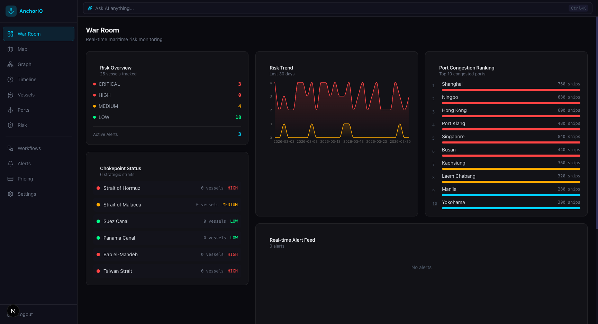
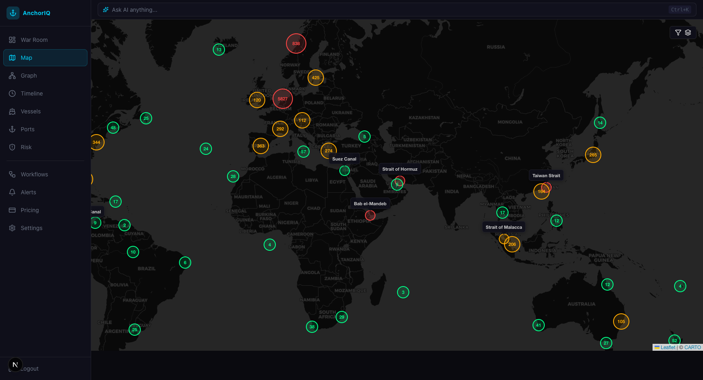
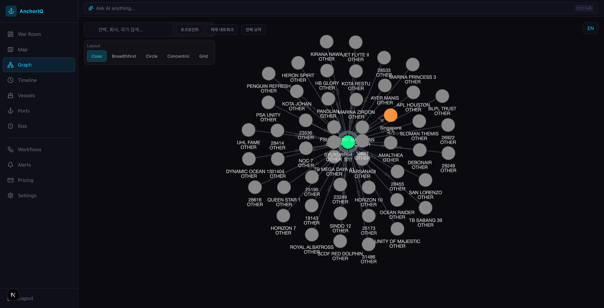
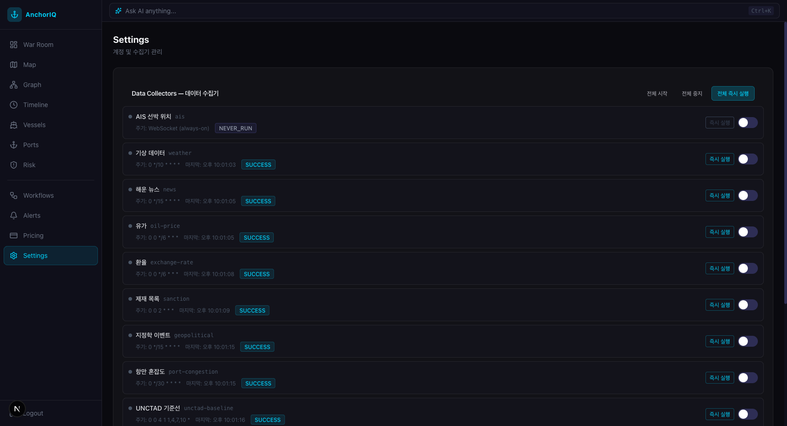

# AnchorIQ

**Maritime Supply Chain Risk Detection & Action Automation Platform**

Palantir Foundry/Gotham style portfolio project. Fuses 11 free API data sources into an ontology (Neo4j), AI (OpenClaw) assesses risk, and n8n automates actions.

## Screenshots

### War Room


### Map (Real-time AIS Vessel Tracking with Clustering)


### Ontology Graph (Search Around - Palantir Vertex Style)


### Settings (Data Collector Management)


## Architecture

```
[11 Data Sources]  -->  [Kafka]  -->  [Spring Boot]  -->  [Neo4j Ontology]
  AIS WebSocket           |            |                      |
  Weather API             |         [Redis]               [AI Engine]
  News API                |          GEO Cache               |
  Sanctions               |            |                  [n8n Automation]
  Oil Price               |         [PostgreSQL]              |
  Exchange Rate           |          Users/Payments       [Discord Alert]
  Geopolitical            |            |
  Port Congestion         |         [Elasticsearch]
  UNCTAD                  |          News/Log Search
```

### Backend (Spring Boot Multi-Module)
```
anchoriq-core/        -- Pure Domain (Entity, VO, Domain Service, Repository Interface)
anchoriq-api/         -- REST Controller, DTO, Security, Infrastructure Implementation
anchoriq-collector/   -- 9 Data Collectors, Kafka Producer/Consumer
anchoriq-ai/          -- OpenClaw Integration, Risk Scoring
anchoriq-automation/  -- n8n Integration, Alert Automation
```

### Frontend (Next.js 16 App Router)
- React 19 + TypeScript
- Leaflet + MarkerCluster (Map with 20,000+ vessel clustering)
- Cytoscape.js (Ontology Graph with Search Around)
- Tailwind CSS (Palantir-inspired dark theme)

### Database (4 DBs)
| DB | Purpose | Data |
|----|---------|------|
| PostgreSQL 16 | Users, Payments, Subscriptions | ACID Tier 1 |
| Neo4j 5 CE | Ontology Graph (Vessel-Company-Country-Sanction) | 26,000+ nodes, 1,200+ relationships |
| Redis 7 | Real-time AIS Position Cache (GEO) | 18,000+ vessel positions |
| Elasticsearch 8 | News/Log Full-text Search | Tier 3 |

### Messaging
- Kafka (KRaft mode, no Zookeeper)
- 6 topics: ais-positions, weather-events, market-data, sanction-updates, port-congestion, risk-alerts
- 9 consumer groups

## Key Features

### Real-time AIS Vessel Tracking
- AISstream.io WebSocket -- 26,000+ vessels globally
- Redis GEO spatial indexing -- O(log(N)) radius queries
- Leaflet MarkerCluster -- smooth rendering of 20,000+ markers

### Ontology-based Risk Detection
- Neo4j Knowledge Graph -- 4-hop relationship traversal
- Vessel -> Company -> Country -> Sanction chain detection
- Auto-relationship builder (MMSI MID -> nationality, GEO -> port docking)
- Search Around UI (Palantir Vertex style progressive disclosure)

### Data Collection Pipeline
- 9 collectors (AIS, Weather, News, Oil Price, Exchange Rate, Sanctions, Geopolitical, Port Congestion, UNCTAD)
- Kafka event streaming with Dead Letter Topic
- Manual trigger API: `POST /api/admin/data-pipeline/trigger/{source}`

### Automation
- n8n workflow: Kafka -> risk alert -> Discord notification
- Configurable collector scheduling (cron-based)

## Tech Stack

| Category | Technology |
|----------|-----------|
| Backend | Java 21, Spring Boot 3.4, Spring Security, Spring Data JPA/Neo4j/Redis, Spring Kafka |
| Frontend | Next.js 16, React 19, TypeScript, Tailwind CSS, Leaflet, Cytoscape.js |
| Database | PostgreSQL 16, Neo4j 5 CE, Redis 7, Elasticsearch 8.13 |
| Messaging | Apache Kafka (KRaft) |
| Automation | n8n |
| Payment | Stripe + Toss Payments (Strategy Pattern) |
| Monitoring | Prometheus + Grafana |
| Test | JUnit 5, Testcontainers, k6 |
| Infra | Docker Compose |

## Quick Start

```bash
# 1. Infrastructure
cd infra && docker-compose --profile core --profile data up -d

# 2. Backend
cd backend && ./gradlew :anchoriq-api:bootRun --args='--spring.profiles.active=local'

# 3. Frontend
cd frontend && pnpm install && pnpm dev

# 4. Access
# Frontend: http://localhost:3004
# Backend API: http://localhost:8082
# Create account at /signup
```

## Documentation

| Document | Description |
|----------|------------|
| [Ontology CS Deep Dive](docs/ONTOLOGY_CS_DEEP_DIVE.pdf) | Ontology concepts, Cypher basics, Neo4j vs RDB performance |
| [Troubleshooting Report](docs/TROUBLESHOOTING_REPORT_20260331.pdf) | 5 production debugging cases with CS principles |
| [Server Start/Stop Guide](docs/SERVER_START_STOP.md) | How to start/stop all services |
| [Architecture](plan/ARCHITECTURE.md) | System architecture and ontology model |
| [API Endpoints](plan/API_ENDPOINTS.md) | 174 REST API + 3 WebSocket endpoints |

## Troubleshooting Highlights

| Issue | Root Cause | Resolution |
|-------|-----------|------------|
| Redis dual instance (DBSIZE=0) | Homebrew Redis vs Docker Redis port conflict | Docker Redis port 6380 |
| Redis GEO data disappearing | TTL 30s + Cleanup 1min race condition | TTL 5min + Cleanup 6min |
| AIS WebSocket 1003 close loop | TextWebSocketHandler rejects binary frames | AbstractWebSocketHandler |
| Sanctions collector 0 records | Wrong API URL + 256KB buffer overflow | NDJSON endpoint + 10MB buffer |
| Neo4j Vessel 0 after AIS | Consumer only updated existing, never created | Auto-create from AIS data |
