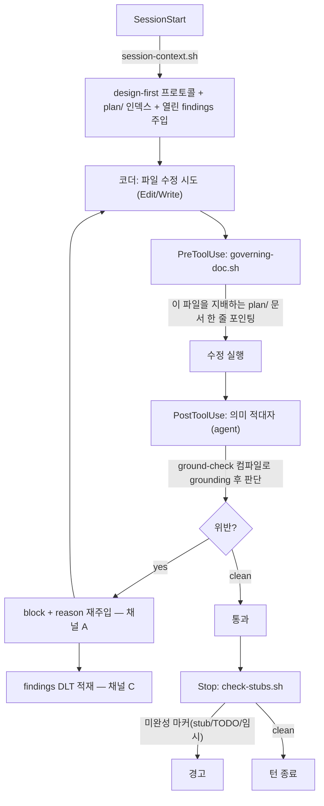
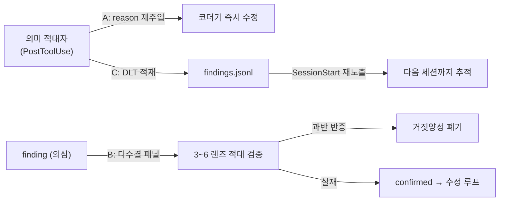
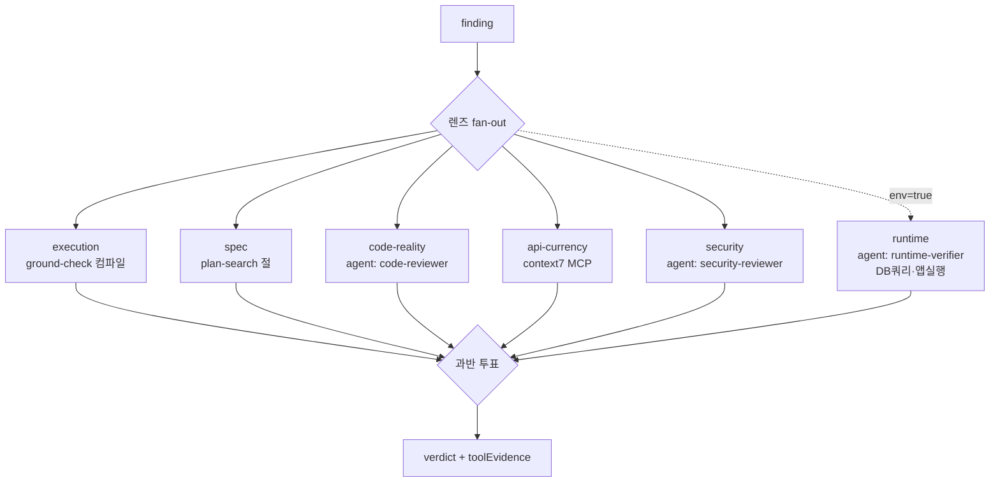
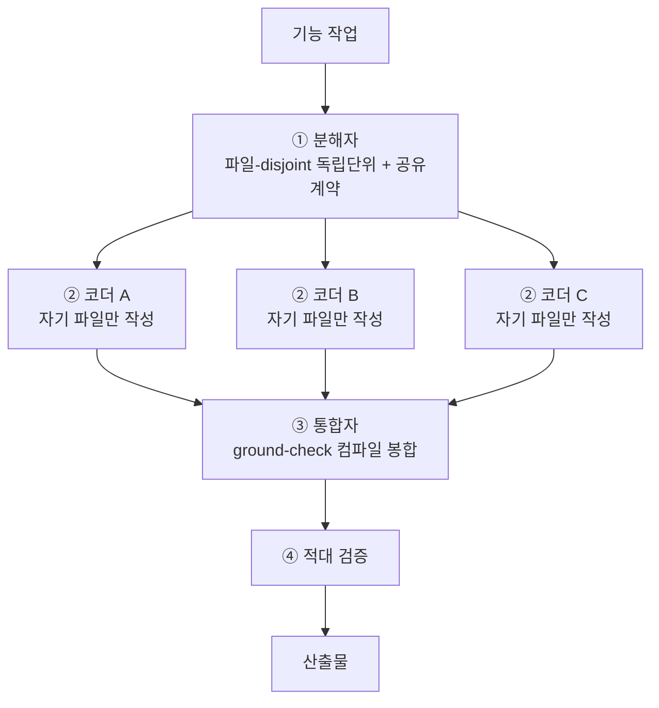
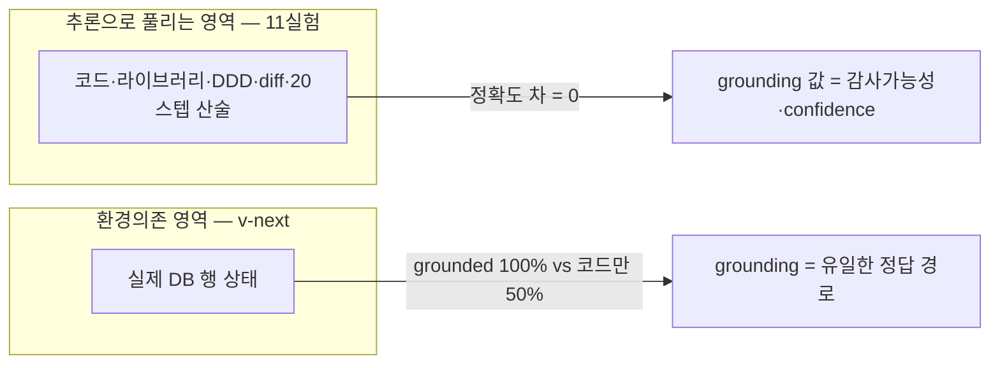

# 개요 — 하네스 엔지니어링이란

> **명제**: 설계 규칙을 *산문(prose)*으로 적어두면 안 지켜진다. 규칙을 **결정론적으로 강제되는 훅(hook)**과 **적대적으로 검증하는 에이전트**로 승격시켜야, 코드가 커지고 에이전트가 많아져도 품질이 유지된다.

AnchorIQ 하네스는 이 명제를 한 리포 안에서 실제 작동하는 **에이전트 하네스**로 구현한 것이다. "설계 문서 학습 의무", "임시방편 금지(정석)", "DDD/트랜잭션 규칙" 같은 팀 규칙을 — `CLAUDE.md`에 적어만 두는 게 아니라 — **세션 시작·파일 수정 전·수정 후·턴 종료** 네 시점에 자동으로 개입하는 가드로 만들었다.

이 보고서는 그 하네스의 **기능·흐름·설계 근거**를 정리한다. 모든 주장은 동료심사 논문(`docs/papers/` 16편)과 우리가 직접 측정한 **12개 실험**에 근거한다.

### 한눈에 — 무엇으로 이루어졌나

| 구성 | 정체 | 역할 |
|------|------|------|
| **4개 훅** | `.claude/settings.json` | 세션·수정전·수정후·종료 시점에 자동 개입 |
| **하네스 스크립트** | `scripts/harness/*.sh` | 컨텍스트 주입·컴파일 grounding·미완성 검출 |
| **의미 적대자** | `review-protocol.md` (agent 훅) | DDD/계약 위반을 *판단*으로 검사 |
| **전파 3채널** | A/B/C | 검출된 위반을 코더·세션·미래로 전파 |
| **검증 패널** | `verify-findings-grounded.workflow.js` | 6렌즈 다수결 적대 검증 + 커스텀 에이전트 |
| **오케스트레이션** | `orchestrate-feature.workflow.js` | 대규모 코드 작성: 분해→병렬→통합 |
| **eval 프레임워크** | `scripts/harness/eval/` | 가설을 측정으로 — 12실험, capstone |

---

# 왜 — 산문 규칙은 지켜지지 않는다

`.sh`(결정론) vs `.md`(판단)의 분업이 하네스의 핵심이다.

- **기계적으로 확정 가능한 것**(파일 경로→지배 문서 매핑, 컴파일 통과 여부, 미완성 마커 존재)은 **`.sh` 명령 훅**으로 강제한다. LLM에 맡기면 확률적으로 빠뜨리지만, 셸은 100% 일관적이다.
- **판단이 필요한 것**(이 코드가 DDD를 위반하나, 이 finding이 거짓양성인가)은 **`.md` 에이전트 훅**으로 맡긴다.

> 동료심사 근거: 외부 피드백 없는 LLM 자가수정은 자주 **악화**된다(Huang, ICLR 2024 `2310.01798`; Kamoi, TACL 2024 `2406.01297`). → 그래서 판단조차 **외부 신호(컴파일·검색·도구)에 grounding**시킨다.

---

# 아키텍처 — 4개 훅의 생명주기

하네스는 Claude Code의 4개 훅 시점에 개입한다. 코더(메인 에이전트)가 파일을 수정하는 한 턴의 흐름:

| 시점 | 훅 | 종류 | 하는 일 |
|------|----|----|---------|
| 세션 시작 | `session-context.sh` | `.sh` | design-first 프로토콜·`plan/` 인덱스·**열린 findings 재노출** |
| 수정 전 | `governing-doc.sh` | `.sh` | 수정 파일을 지배하는 `plan/` 설계문서를 한 줄로 포인팅(코드 파일만) |
| 수정 후 | 의미 적대자 | `.md` agent | DDD/트랜잭션/계약 위반 검사 → 위반 시 block |
| 턴 종료 | `check-stubs.sh` | `.sh` | 백엔드 main 소스의 미완성 마커 경고 |

### 무엇이 강제되고, 무엇이 아직 갭인가 (정직한 커버리지)

각 규칙을 *그 성격에 맞는 메커니즘*으로 강제한다 — 기계적인 건 `.sh` 린트, 판단형은 적대자, 자동 강제 불가는 소프트 리마인더. 측정한 커버리지:

| 규칙 | 강제? | 어디서 |
|------|:---:|--------|
| design-first 학습 의무 | ✅ | SessionStart + governing-doc |
| DDD 레이어·인터페이스·트랜잭션·캡슐화·계약 | ✅ | 의미 적대자 §2 |
| 미완성 마커(stub/TODO/임시) | ✅ | check-stubs.sh (Stop) |
| 파일 분리(200줄/7메서드, SRP) | ✅ warn | lint-conventions.sh (PostToolUse) |
| 모듈 의존(core는 외부 모듈 import 금지) | ✅ warn | lint-conventions.sh |
| 시크릿 하드코딩 금지(AGENTS 9) | ✅ | lint(grep 1차) + 적대자(의미) |
| 패키지/모듈 배치(PACKAGE_STRUCTURE) | ✅ | lint(모듈 import) + 적대자(의미 배치) |
| 트러블슈팅 문서화(AGENTS 11) | △ 리마인더 | SessionStart 소프트 리마인더(기계 강제 불가) |

> 메커니즘-규칙 정합: 기계적으로 확정 가능한 규칙(파일크기·모듈의존·시크릿 grep)은 `lint-conventions.sh`가 non-blocking warn으로, 판단이 필요한 위반(의미적 배치·우회 시크릿)은 의미 적대자가, 기계 강제가 *원리적으로* 불가능한 것("버그를 고쳤는지" 자동 판정 불가 → 트러블슈팅 문서화)은 소프트 리마인더로. 갭을 "전부 hard block"이 아니라 *성격에 맞게* 메웠다.

---

# 전파 3채널 — 검출된 위반을 어디로 보내나

적대자가 위반을 찾으면, 그 정보가 **세 방향**으로 전파된다. 이것이 "부정적 에이전트가 디버깅 내용을 전파하는" 메커니즘이다.

- **채널 A — reason 재주입**: 적대자가 `decision:block` + `reason`(① 위반 ② 어느 plan/ 규칙 ③ 어떻게 고칠지)을 반환하면, 그 사유가 코더에게 재주입되어 코더가 **즉시 고친다**. (block→fix→재검토 루프가 네이티브 에이전트 루프로 돈다.)
- **채널 B — 다수결 검증단**: 의심 finding을 여러 렌즈의 적대자에게 보내 **과반(2/3)이 반증하면 거짓양성으로 폐기**. self-consistency(Wang, ICLR 2023)·LLM-judge(Zheng, NeurIPS 2023) 근거.
- **채널 C — findings DLT**: 위반을 `findings.jsonl` 원장에 적재. **열린 finding은 매 세션 SessionStart에 재노출**되어 닫힐 때까지 추적된다(Dead Letter 원리).

---

# design-first + 컨텍스트 최적화

대규모로 갈수록 코딩 에이전트는 전체 설계를 머리에 못 담아 **드리프트(설계 이탈)**가 누적된다. 하네스의 컨텍스트 엔지니어링이 이를 막는다.

- **`governing-doc.sh`**: 파일 경로 → 그 파일을 지배하는 `plan/` 문서로 라우팅. (예: `*Controller*.java` → `API_ENDPOINTS.md` + `TRANSACTION_DESIGN.md(Tier1)`)
- **`plan-search.sh`**: 긴 설계문서를 **통째 주입하지 않고** 관련 *절(section)만* 추출. (`ARCHITECTURE.md` 373줄 → Domain Service 절 13줄)

> 근거: 긴 컨텍스트의 중간 정보는 소실된다 — *lost-in-the-middle* (Liu, `2307.03172`). 통째 주입은 정량적으로 나쁘다. → 관련 절만 주입하는 게 정석.

---

# 검증 패널 — 6렌즈 + 커스텀 에이전트 + MCP

채널 B의 다수결 패널을 **도구 쥔 6개 렌즈**로 고도화했다. 각 렌즈가 "읽기"가 아니라 **전용 도구 실행**으로 grounding한다.

| 렌즈 | 도구 | env 필요 |
|------|------|:---:|
| execution-grounded | `ground-check.sh`(컴파일) | — |
| spec-retrieval | `plan-search.sh`(절 추출) | — |
| code-reality | `agentType: harness-code-reviewer` | — |
| api-currency | **context7 MCP**(최신 API 문서) | — |
| security | `agentType: harness-security-reviewer` | — |
| runtime-data / behavior | `harness-runtime-verifier` + Postgres MCP/playwright | ✅ |

**스킬 → 커스텀 에이전트 배선**: verify/code-review/security-review 스킬의 *방법론*을 `.claude/agents/harness-*.md` 시스템프롬프트에 내장하고, 렌즈가 `agentType`으로 부착(schema와 합성). 무관 차원 렌즈는 `none(not ...)`+low로 자기 표를 빼 다수결을 왜곡하지 않는다.

---

# 대규모 코드 작성 오케스트레이션

상호의존 코드 공동작성을 멀티에이전트로 하면 충돌한다(Cognition "Don't Build Multi-Agents"). 그래서 **독립 단위만 병렬, 하나가 통합**하는 orchestrator-worker 패턴(Anthropic)을 구현했다.

**쪼개는 기준**: ① 파일 disjoint(같은 파일 건드릴 둘은 한 단위) ② 계약으로만 의존 ③ DDD 레이어·모듈 경계 ④ 응집도. **명령 전파**는 에이전트 간 통신이 아니라, 분해자가 만든 *공유 계약*을 각 코더 프롬프트에 **fan-out**하는 방식 — 워커는 서로 blind, 봉합은 통합자가.

> 핵심 신뢰성 결정: 병렬은 *쓰기만*(gradle 락 회피), 컴파일은 단일 통합자가 한 번에. 멀티에이전트 코딩의 실패모드(공유 코드 충돌)를 파일 disjoint로 원천 차단.

**실증 (dogfood, 2026-06-07)**: 실제 기능(ETA 지연 등급)으로 1회 실행 → 분해 2단위 · 병렬 코더 2명이 **충돌 없이 13파일 작성** · **core/api 양 모듈 컴파일 통과**(VO·일급컬렉션·인터페이스 분리 등 DDD 준수). 동시에 워크플로우의 *보고 schema* 버그(통합/검증의 복잡 schema가 StructuredOutput 누락 → null)를 발견·수정했다. → **오케스트레이션 개념은 검증, 보고 레이어는 schema 단순화로 보강.** (생성 코드는 테스트 fixture라 revert.)

---

# self-repair 가드 — 7개 중 5개 충족

자율 수정 루프는 자율성을 *최대화*가 아니라 **bound(한정)**하고 **외부 신호에 grounding**해야 한다(안 그러면 고칠수록 나빠짐).

| # | 가드 | 우리 하네스 |
|---|------|------------|
| 1 | 외부 피드백 필수 | ✅ ground-check·check-stubs |
| 2 | 실행/테스트 grounding 게이트 | ✅ `ground-check.sh --test` |
| 3 | process(단계) 검증 | ✅ 파일 단위 PostToolUse |
| 4 | 독립 verifier + 궤적 평가 | ✅ 채널 B(검증자≠코더) |
| 5 | 다수결/다중 샘플 | ✅ 과반 판정 |
| 6 | bounded 자동 루프 | ⬜ 설계만(의도적 미구현) |
| 7 | reward-hacking 감시 | ⬜ |

> 6은 **일부러** 안 만들었다 — 자율 무한 루프는 grounding·bound 없이 발산하므로, 메인 에이전트/사람을 게이트로 남기는 게 현재로선 더 안전(Tier A 근거).

---

# eval 연구 — 12실험과 capstone

하네스 가설을 일화가 아니라 **측정**으로 검증했다. ground-truth 라벨 finding으로, grounding 유무·렌즈 수·framing 등을 흔들며 verdict 정확도를 쟀다.

| 실험 | 흔든 축 | 결과 |
|------|---------|------|
| H1 | 도구 grounding vs 읽기 | 정확도 차 0 |
| H2 | 렌즈 1 vs 3 | 불일치 0% |
| H3 | grounding 제거(컴파일에러) | intrinsic도 추론으로 잡음 |
| H4 / H4b | framing bias / 코드접근 제거 | 0 flip / blind도 강건 |
| v3 / H8 | 20스텝 산술 / 라이브러리 edge | 둘 다 모델이 앎 |
| DETECT | 진짜 DDD 위반 탐지 | 잡음(missed 0) |
| H11 | 루브릭 vs 자유서술 | verdict 동일, 비존재규칙 적발 |
| H5 | 궤적(diff) | 정확 추론 |
| **v-next** | **실제 DB 상태** | **grounded 100% vs 코드만 50% ★** |

**Capstone (검증완료)**: capable LLM 패널은 **추론으로 풀리는 모든 것**에 극도로 강건하다(11실험 정확도 차 0). grounding/구조의 *측정된* 값은 정확도가 아니라 **감사가능성·confidence**다. 단 **추론으로 못 푸는 환경의존(실제 DB 행)**에선 grounded가 100%, 코드만 보는 패널은 우연(50%)으로 — **grounding이 유일한 정답 경로**다. 경계를 양방향으로 확정했다.

> v-next 설계: 글자까지 같고 `user_id`만 42 vs 7 다른 쌍둥이 finding. 코드상 구별 불가 → DB를 쿼리한 패널만 둘 다 정답.

---

# 재사용·이식성 (향후)

이 하네스의 진짜 가치는 `.sh` 파일이 아니라 **검증된 설계 + 새 프로젝트에 꽂는 레시피**다. 현재 AnchorIQ 전용(plan/ 경로·gradle 모듈·.java)이 5개 스크립트에 박혀 있어, 다음 단계는 **`harness.config.json` 추출 + `DEPLOY_HARNESS.md` 레시피**로 — AI가 다른 프로젝트에 응용할 때 검증된 설계로 *수렴*하게 만드는 것이다.

---

# 결론

- 산문 규칙을 **강제 훅 + 적대 에이전트**로 승격했고, 위반을 **3채널(코더·세션·미래)**로 전파한다.
- 검증 패널은 **6렌즈 + 커스텀 에이전트 + MCP**로 도구 grounding한다.
- 대규모 작성은 **분해→병렬→통합** 오케스트레이션으로, 멀티에이전트 코딩의 충돌을 회피한다.
- **12실험**으로 하네스의 효용 경계를 측정했다: 품질을 올리는 건 *포장(agent/skill)*이 아니라 **검증자가 실제로 실행·쿼리하는 것**(런타임 grounding)이다.
